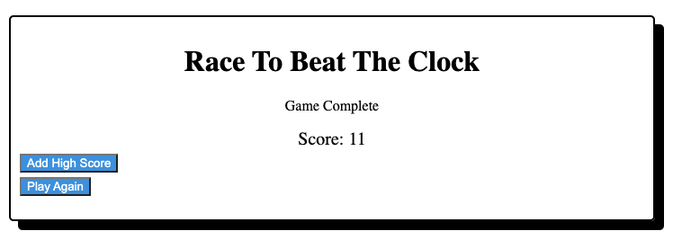

# Timed-Quiz

This project is a timed quiz.

When clicking start it initiates a countdown timer and displays the first question.

If you get an answer right than it moves to the next question.
If you get an answer wrong it will subtract 15 seconds from the time and moves to the next question.

Apon completion of the 5 questions it will display complete, your score, and three buttons. One to add your initials and be added to the highscore page, one to view the highscore page, and one to play again.

On click of the Leaderboard button it shows a sorted view of scores and initials.

